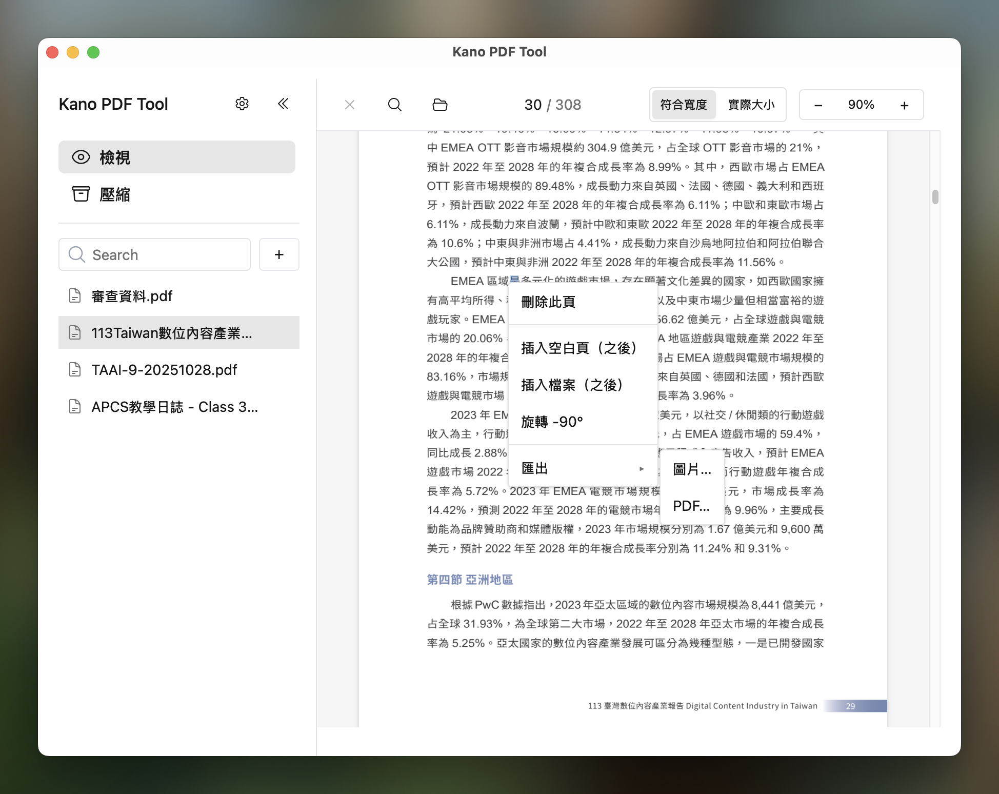

# Kano PDF Tool

一個功能強大的跨平台 PDF 編輯與閱讀工具。



## 支持這個專案

如果這個專案對你有幫助，歡迎透過以下方式支持 ☕

### Buy Me a Coffee

[](https://www.buymeacoffee.com/yuuf.25)

或掃描 QR Code：


## 主要功能

### PDF 編輯
- **頁面管理**：刪除頁面、新增空白頁
- **單頁匯出**：支援將單一頁面匯出為 PDF 或圖片格式
- **文件壓縮**：內建 PDF 壓縮功能，減少檔案大小

### PDF 閱讀
- **高品質渲染**：基於 PDFium 引擎，提供精確的 PDF 渲染
- **文字選擇與搜尋**：支援全文搜尋並高亮顯示搜尋結果
- **暗色模式**：內建暗色模式支援，並可選擇 PDF 內容顏色反轉功能

### 圖片處理
- **多格式支援**：支援 PNG、JPG 等常見圖片格式
- **圖片壓縮**：提供圖片壓縮功能
- **圖片查看**：內建圖片瀏覽器

### 檔案管理
- **側邊欄檔案列表**：方便管理和切換多個文件
- **檔案關聯**：支援 PDF 和圖片檔案的系統關聯，可直接開啟檔案


## 安裝與使用

### 下載安裝包

| 平台 | 版本 | 連結 |
|------|------|------|
| macOS | Apple Silicon (ARM64) | [下載](https://github.com/IDK-Silver/PDF_Tool/releases/download/3.8.0/Kano.PDF.Tool_3.8.0_aarch64.dmg) |
| Windows | x64 | [下載](https://github.com/IDK-Silver/PDF_Tool/releases/download/3.8.0/Kano.PDF.Tool_3.8.0_x64-setup.exe) |
| Linux | - | 請參考下方的開發環境設定自行編譯 |

### macOS 使用說明

由於未申請 Apple 開發者帳號，macOS 系統可能會阻擋應用程式執行。安裝後請執行以下命令來移除隔離屬性：

```bash
sudo xattr -cr /Applications/Kano\ PDF\ Tool.app/
```

## Star History

[](https://star-history.com/#IDK-Silver/PDF_Tool&Date)

## 貢獻

歡迎提交 Issue 和 Pull Request 來幫助改進這個專案。

## 開發環境設定

### 環境需求
- Node.js 18+
- Rust 1.70+
- 對應平台的 Tauri 依賴項

### 安裝步驟

1. 克隆專案
    ```bash
    git clone https://github.com/IDK-Silver/PDF_Tool.git
    cd PDF_Tool
    ```

2. 安裝依賴
    ```bash
    npm install
    ```

3. 下載 PDFium 函式庫
    ```bash
    npm run pdfium:fetch
    ```

4. 啟動開發伺服器
    ```bash
    npm run tauri dev
    ```

5. 建構應用程式
    ```bash
    npm run tauri build
    ```

## 授權

本專案採用 GPL-3.0 授權條款。
