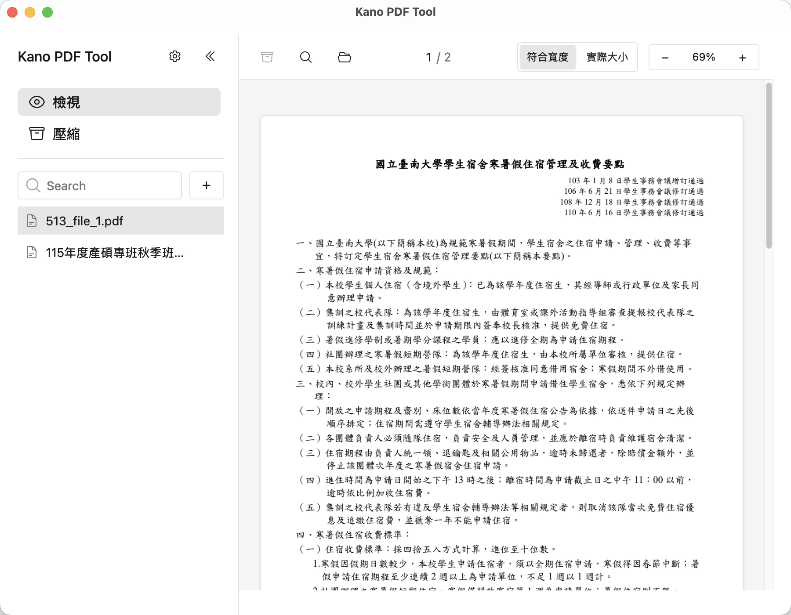
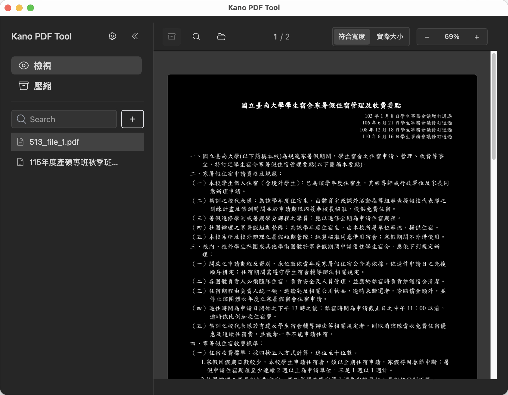

<a href=".">English</a> | 繁體中文

<table class="screenshot-table">
  <tr>
    <td><strong>淺色主題</strong></td>
    <td><strong>深色主題</strong></td>
  </tr>
  <tr>
    <td></td>
    <td></td>
  </tr>
</table>

## 主要功能

| PDF 編輯 | PDF 閱讀 | 圖片處理 |
|:--------:|:--------:|:--------:|
| 刪除 / 新增頁面 | 高品質渲染 | 多格式支援 |
| 單頁匯出 | 文字選擇與搜尋 | 圖片壓縮 |
| PDF 壓縮 | 暗色模式 | 圖片瀏覽 |

## 下載

  <a href="https://github.com/IDK-Silver/PDF_Tool/releases/latest" class="btn">下載 macOS 版</a>
  <a href="https://github.com/IDK-Silver/PDF_Tool/releases/latest" class="btn">下載 Windows 版</a>

  macOS：Universal Binary（Intel 與 Apple Silicon）· 已簽名與公證 
  Windows：x64 · 提供安裝檔與免安裝版

